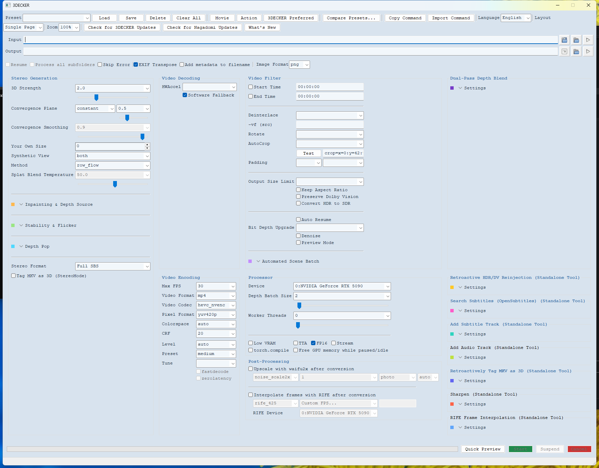
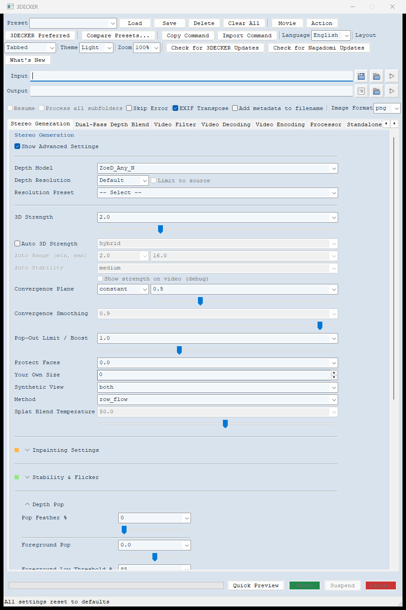
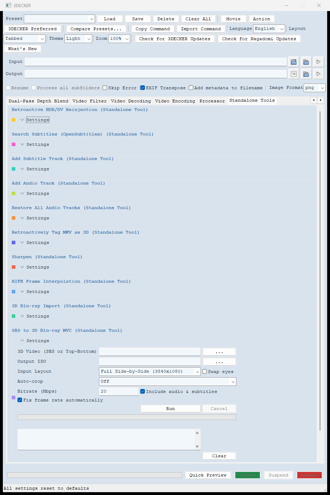
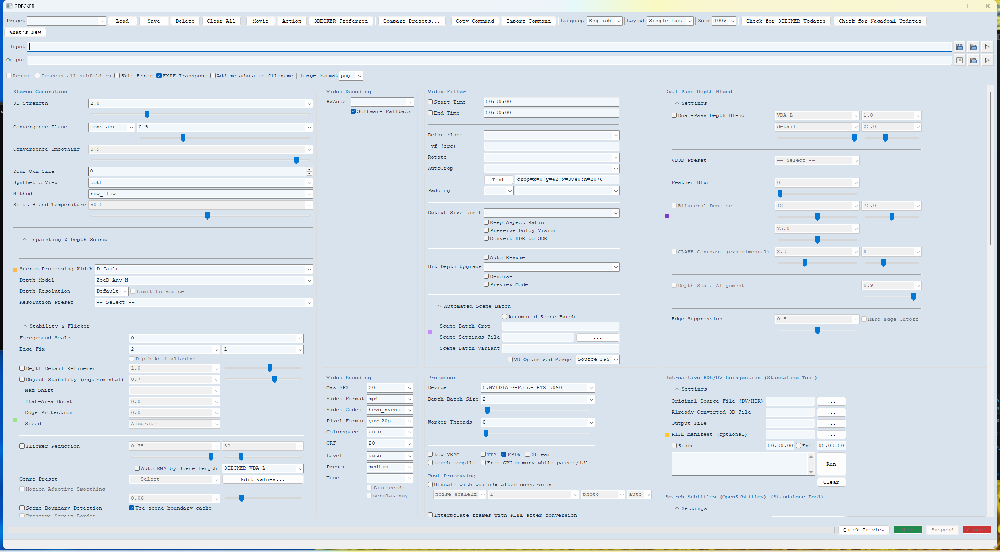
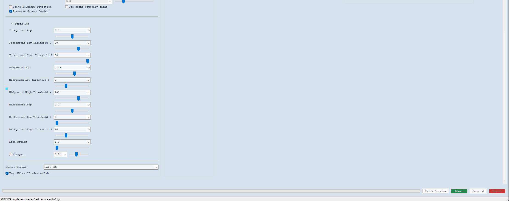
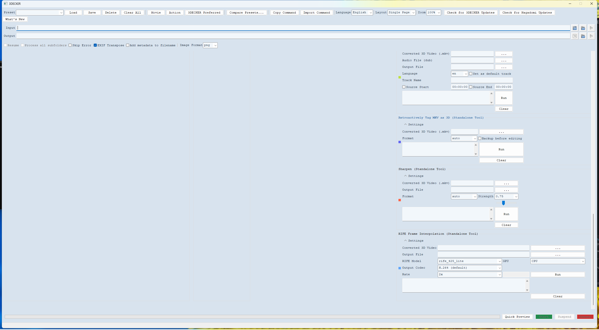

# 3DECKER

**3DECKER** is a customized Windows build of **iw3** (this repo's 2D-to-3D video
converter), built on top of [nunif](https://github.com/nagadomi/nunif) by
nagadomi — this repository is that upstream project, with 3DECKER's changes
layered on top on the `my-customizations` branch.

- **New here?** Start with [`3DECKER_INSTALL.md`](3DECKER_INSTALL.md) — the full
  install guide (one-file setup, no separate Python/tools install needed).
- **Using the app?** [`3DECKER_README.md`](3DECKER_README.md) explains what
  everything does in plain language, and [`3DECKER_SETTINGS_GUIDE.md`](3DECKER_SETTINGS_GUIDE.md)
  covers every individual setting in detail.
- **What's changed recently?** See [`3DECKER_CHANGELOG.md`](3DECKER_CHANGELOG.md).

## Recent Highlights

- **Turn a real 3D Blu-ray disc into a normal video file (or a lossless backup
  ISO), and go the other way too** — turn your own 3D video into a real 3D
  Blu-ray disc image, with an opt-in fix for videos whose frame rate isn't
  Blu-ray-legal.
- **Auto 3D Strength, Pop-Out Limit / Boost, and Protect Faces** shape the 3D
  effect per scene and per shot instead of one fixed setting for the whole
  movie, with a "Show Advanced Settings" toggle keeping the everyday controls
  uncluttered.
- **Dolby Vision and HDR now survive RIFE smoothing and the AI upscaler**,
  and every after-conversion step (upscale, RIFE, audio/subtitle restore)
  chains into one final file instead of several separate ones.
- **Restore every audio track and subtitle from your source automatically**
  after conversion, right from a checkbox on the main screen.
- **A real Light / Dark / System theme**, an automatically-resizing window,
  and dozens of smaller fixes and quality-of-life improvements.

## Everything 3DECKER Adds Over Stock iw3

<b>3D Blu-ray Tools</b> — import a real disc, or build one from your own video

- **3D Blu-ray Import** turns a real 3D Blu-ray disc (a disc image or a ripped
  disc folder) into a normal 3D video file you can play in VLC, MPC-HC, or on
  a 3D TV. It finds the main movie itself, reads both eyes' pictures, and
  keeps the disc's audio tracks and subtitles. Pick the 3D arrangement (Full
  or Half Side-by-Side, Full or Half Top-Bottom, or Frame Packed) and video
  format (GPU-accelerated H.265 by default, or CPU H.265/H.264).
- **Lossless 3D Blu-ray ISO** copies the disc's own 3D video into a new ISO
  with zero re-encoding, for a perfect backup or to play on a real 3D Blu-ray
  player / PowerDVD.
- **SBS to 3D Blu-ray MVC** goes the other direction: turns one of your own 3D
  videos into a real 3D Blu-ray disc image, playable on a 3D Blu-ray player,
  PowerDVD, or burned to a BD-R.
- **Fix frame rate automatically** (opt-in, off by default) — 3D Blu-ray only
  allows 23.976/24fps, so a video at any other rate used to just get refused.
  This genuinely re-times the whole movie — picture, sound (pitch kept
  correct), and subtitles together — to the nearest allowed rate, the same
  trick used for classic PAL/NTSC conversions.
- Both tools support Auto-crop (removes black bars from each eye) and 4K
  layouts.

<b>Shaping the 3D Effect</b> — Auto 3D Strength, Pop-Out Boost, Protect Faces, Pop Feather

- **Auto 3D Strength** picks the 3D Strength per scene from how close the
  shot looks — wide shots and landscapes get less, close-ups get more —
  instead of one fixed value for the whole movie, the way a real stereo
  camera behaves.
- **Pop-Out Limit / Boost** works in both directions: below 1.0 it's a safety
  cap on how far things pop out, above 1.0 (up to 3.0) makes things in front
  of the screen come out further.
- **Protect Faces** reduces the facial warping a strong 3D Strength or
  Pop-Out Boost can cause on a close-up face, by gently flattening each
  detected face's own depth before Pop-Out Boost sees it.
- **Pop Feather %** softens the hard edge of Foreground/Midground/Background
  Pop (the sliders that push a chosen depth slice toward or away from the
  screen), turning a visible cutoff line into a smooth blend.
- A **"Show Advanced Settings" toggle** on Stereo Generation keeps the
  everyday controls (Depth Model, 3D Strength, Convergence Plane, Method)
  front and center, with all of the above tucked behind one checkbox.

<b>3D Conversion Quality</b>

- **Dual-Pass Depth Blend** — runs two different AI depth models on your
  video and blends their results together frame by frame, leaning on the
  second model specifically where it helps most (like sharp edges), without
  needing double the graphics card memory.
- **Subpixel Z-Splat** — blends two pixels landing on the same spot based on
  which is genuinely closer to the camera, instead of picking one winner and
  creating a hard, jagged edge.
- **Depth Detail Refinement** — smooths noisy depth using a filter that
  respects real edges instead of blurring across them.
- **Edge Suppression and Edge Repair** — reduce the faint doubled/ghosted
  outline that can appear where two blended depth models disagree, or general
  fringing around any depth edge.
- **Depth Scale Alignment** — lines up two models' depth ranges before
  blending them, so there's no visible seam.
- **Object Stability** — tracks how objects actually move (real motion
  tracking, not just the depth map) and carries each object's own depth
  history along with it, with an Accurate/Fast speed trade-off.

<b>Depth Models</b> — many more AI models than stock iw3, most downloaded automatically

Depth-Anything-3 (Small/Base/Large/Giant/Metric-Large/Nested-Giant-Large),
Metric3D v2 (ConvNeXt Tiny/Large, ViT Small/Large/Giant2), MoGe-3 (ViT-L/G),
Video Depth Anything (Base/Large + Streaming), Distill Any Depth (Base/Large),
and `Any_V3_Metric_Large_Native` (a corrected-scale-handling variant of the
existing Metric_Large model) all join the depth model list. A **Resolution
Preset** dropdown offers 21 tested resolution values instead of needing to
know the right number to type in.

<b>Keeping the 3D Effect Steady</b> — flicker, wobble, and scene-aware smoothing

- **Flicker Reduction** smooths the overall near/far depth range over time,
  with a **Genre Preset** quick-fill (Fast Action / Medium-Magical /
  Drama-Slow-Paced).
- **Object Stability** tracks individual objects and smooths their own depth
  over time independently of the rest of the scene.
- **Auto EMA by Scene Length** automatically picks a smoothing strength based
  on each scene's own length, from nine selectable (and fully editable)
  built-in tables.
- **Scene Boundary Detection** resets smoothing cleanly at every real cut.
- A one-click **"3DECKER Preferred"** preset applies this project's own
  tested combination of depth, stability, and smoothing settings at once.
- **Automated Scene Batch** — a fully hands-off mode that splits a whole
  movie into individual scenes, converts each independently, and joins
  everything back together with the original audio re-attached.

<b>Frame Smoothing (RIFE)</b>

RIFE generates brand-new, genuinely synthesized in-between frames (not simple
duplication or crossfading) so motion looks smoother at a higher frame rate.
Available both as an in-pipeline option and a standalone tool for videos
you've already converted, with a simple 2x/3x/4x multiplier or an exact
target frame rate, and two quality tiers.

<b>Dolby Vision & HDR</b>

- The main conversion can **preserve Dolby Vision and HDR10+ metadata** end
  to end.
- **RIFE and Preserve Dolby Vision now work together directly, in the same
  job** — the app converts, smooths with RIFE, and automatically puts the
  original Dolby Vision data back onto the new frames afterward.
- A standalone **Retroactive HDR/DV Reinjection** tool adds Dolby
  Vision/HDR10+ metadata onto a video you already converted, without redoing
  the conversion.
- **Upscaling with waifu2x keeps Dolby Vision and HDR too**, instead of
  flattening the picture to an ordinary 8-bit image.

<b>Subtitles</b>

- Standalone **Search Subtitles** (via OpenSubtitles) and **Add Subtitle
  Track** tools.
- Subtitles position correctly on external 3D players and TVs by default,
  since that's how most output from this tool is actually watched.
- Subtitle text automatically scales to your video's real resolution.
- **SBS to 3D Blu-ray MVC** turns text subtitles into real Blu-ray picture
  subtitles, with a suitable font for Chinese, Japanese, Korean, Thai, Hindi,
  and Arabic.

<b>Audio</b>

- **Restore Audio & Subtitles from Source**, a checkbox right on the main
  conversion screen, automatically restores every audio track and subtitle
  track after conversion finishes — no separate tool or re-typing anything.
- A standalone **Restore All Audio Tracks** tool does the same after the
  fact, for a video you've already converted.
- A standalone **Add Audio Track** tool adds an extra audio track (like a
  different-language dub) to an already-converted video.

<b>Sharpening & Upscaling</b>

- A **Sharpen** filter adds subtle, edge-aware detail without amplifying film
  grain, as both an in-pipeline option and a standalone tool.
- **Upscale with waifu2x** runs any time, not just right after a conversion —
  "Whole frame" for a normal enlargement, or "Stereo-aware 4K/8K" (including
  Full SBS 4K and Full Top-Bottom 4K) which splits the two eyes, upscales
  each separately so detail never blurs across the seam between them, and
  smooths flicker (about 6-7x faster than its first version, with a Fast /
  Accurate / Off choice).
- The GPU's own video encoder is used for every upscale pass instead of the
  CPU, keeping the graphics card working instead of waiting on software
  encoding.

<b>GUI Improvements</b>

- Rebranded **"3DECKER"**, with a real **Light / Dark / System theme**, all
  110+ settings organized into clear tabs, and a window that automatically
  resizes to fit whichever tab you're looking at.
- A **Layout** toggle switches between tabbed and one long scrolling page,
  live.
- **Quick Preset** buttons ("Movie," "Action," "3DECKER Preferred") and a
  **Compare Presets** tool that renders the same clip with multiple presets
  side by side.
- Two clearly separate update checks — **"Check for 3DECKER Updates"** and
  **"Check for Nagadomi Updates"** — each with its own one-click
  **Install Update Now**, plus a quiet background check on launch.
- **After-conversion steps (Upscale, RIFE, Restore Audio & Subtitles) chain
  into one final file** instead of each starting over from the plain
  converted video.
- Every setting's label and control has its own detailed tooltip — 100%
  documented in-app.
- A **Clear All** button resets every setting to defaults, handy before
  sharing a screenshot.

See [`3DECKER_CHANGELOG.md`](3DECKER_CHANGELOG.md) for the full, dated,
plain-language history of everything that's changed (including bug fixes and
a few ideas that were tried and deliberately not kept).

Everything below this point is the original upstream project's own README,
covering the underlying source code, dependencies, and license notes — still
accurate and worth reading if you're building from source or working on
something other than Windows.

---

My playground.

For the time being, I will make incompatible changes.

## waifu2x

[waifu2x/README.md](./waifu2x/README.md)

waifu2x: Image Super-Resolution for Anime-Style Art. Also it supports photo models (GAN based models)

The repository contains waifu2x pytorch implementation and pretrained models, started with porting the original [waifu2x](https://github.com/nagadomi/waifu2x).

The demo application can be found at
- https://waifu2x.udp.jp/ (Cloud version)
- https://unlimited.waifu2x.net/ (In-Browser version).

## iw3

[iw3/README.md](./iw3/README.md)

I want to watch any 2D video as 3D video on my VR device, so I developed this very personal tool.

iw3 provides the ability to convert any 2D image/video into side-by-side 3D image/video.

### iw3-desktop

[iw3/docs/desktop.md](./iw3/docs/desktop.md)

iw3.desktop is a tool that converts your PC desktop screen into 3D and streaming over WiFi.

You can watch any image and video/live displayed on your PC as 3D in realtime.

### iw3-player

[iw3/player/README.md](./iw3/player/README.md)

iw3-player is a self-hosted, specialized viewing environment for stereoscopic media.  
It allows you to stream media that has been pre-converted to 3D with iw3 from your PC and enjoy it on VR devices through a WebXR application.

## stilizer

[stlizer/README.md](./stlizer/README.md)

stlizer is a fast conservative video stabilizer.

## cliqa

[cliqa/README.md](./cliqa/README.md)

`cliqa` provides low-vision image quality scores that are more consistent across different images.

It is useful for filtering low-quality images with a threshold value when creating image datasets.

Currently, the following two models are supported.

- JPEGQuality: Predicts JPEG Quality from image content
- GrainNoiseLeve: Predicts Noise Level related to photograph and PSNR degraded by that noise

CLI tools are also available to filter out low quality images using these results.

## Install

### Installer for Windows users

- [nunif windows package](windows_package/docs/README.md)
- [nunif windows package (日本語)](windows_package/docs/README_ja.md)

### For developers

#### Dependencies

- Python 3 (Works with Python 3.10 or later, developed with 3.10)
- [PyTorch](https://pytorch.org/get-started/locally/)
- See requirements.txt

We usually support the latest version. If there are bugs or compatibility issues, we will specify the version.

- [INSTALL-ubuntu](INSTALL-ubuntu.md)
- [INSTALL-windows](INSTALL-windows.md)
- [INSTALL-macos](INSTALL-macos.md)

For Intel GPUs, additionally see section [INSTALL-xpu](INSTALL-xpu.md).  
For older NVIDIA GPUs, additionally see section [INSTALL-cu126](INSTALL-cu126.md).

For container, packages, or special hardware builds, see [extra_build](extra_build).

#### About NUNIF_HOME

If the environment variable `NUNIF_HOME` is defined, downloaded pretrained models, configuration files, cache, temporary files, and lock files will be saved under `NUNIF_HOME`. This may be useful when packaging or in situations where the source directory does not have write permissions.
The `~` character at the beginning of a path string is expanded to the home directory.

### License Notes

Note that if you distribute binary builds, it is possible that it will be GPL.

This is due to PyAV(av) wheel package containing the GPL version of ffmpeg library.
You can build PyAV with the LGPL version of ffmpeg library.

If you load this repository with torch.hub.load for waifu2x Python API etc, this problem does not exist because PyAV is not a dependent package.
